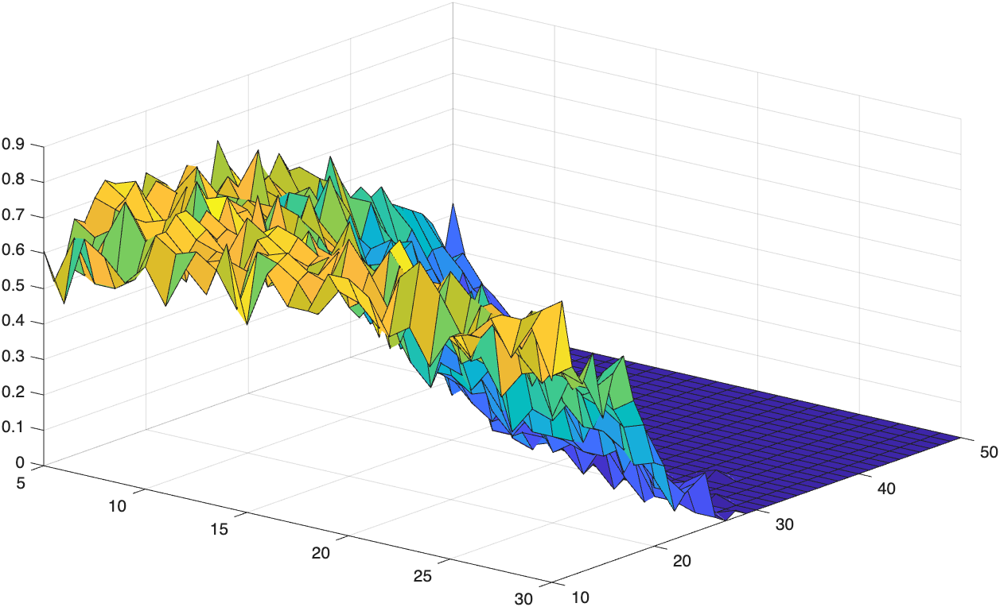

# MCEN3030 Homework 5

This homework involves a lot of plotting, and so it will not be autograded.
- We will still build a GitHub repository, and I've tried to give some hints below about what you should expect the plots to look like.
- You will add all necessary code to the proper directories in your repository. Note that ```problem_2``` and ```problem_3``` will both require your RK4 function. 
- Rename this file to ```README_old.md``` and create a new ```README.md``` file (or copy and clear this one). Instructions for how to populate it are in the problems below.
- You will also submit a pdf version of your README file to Canvas. You can just print the front page of your repository to pdf, or try [https://md2file.com/](https://md2file.com/) again. 


# Problem 1

A stent is essentially a hollow cylinder, placed inside a narrowed artery to prop it open. Traditional stents are permanent and may cause long-term side-effects such as inflammation, artery weakening, and blood clots. An alternative idea: create a bio-absorbable one, one that gives the artery time to strengthen and recover, and then it dissolves. To help with that strengthening process, we might imbue the stent with a drug that will reduce inflammation and promote artery recovery.

We are still in the design phase. There are two questions: What dosage of drug should we provide, and how long should the stent last? Let's suppose we can characterize this procedure in terms of an "effectiveness" variable, $E(L,D,S)$, a function of the lifetime of the stent, $L$, and the drug dosage, $D$. $S$ is a parameter related to the probability of having a side effect.

Write a script ```stent_development``` which will compute the probability $P$ of a successful treatment via a Monte Carlo approach. You will test the 2-dimensional space given by $5\leq L \leq 30$ and $10 \leq D \leq 50$ (steps of $1$ for each) and will use

$$
E(L,D,S)= 24\ln(L\cdot D^2)+0.18L\cdot D^2-9.5(S+4)
$$

as the effectiveness equation. The side effect parameter value $S$ will be randomly chosen from a normal distribution with average $0.02L\cdot D^2$ and standard deviation $6$. (This implies that the chance of side effects increases the longer the stent is in place and the higher the drug dosage, which makes sense.)

Test ```N_tot=1000``` points at each of the $(L,D)$ pairs. We will define a "successful treatment" as a case in which $E \geq 100$. You will compute 

$$
P = \frac{(\text{number of points that give }E>= 100)}{(\text{total number of points})}
$$

at each of the $(L,D)$ pairs. Collect your results into a "surface plot" $P(L,D)$ and display it in your ```README```.

Hints:
- Don't read too much into the actual $E$ values. The thing we care about is the probabability $P$.
- It might take several seconds to run for ```N_tot=1000```. Set ```N_tot=50``` at first while you are programming and then change back to ```1000``` later when you think you've got the bugs out.
- Here is what the plot might look like for ```N_tot=50```, though remember it is based on random numbers so yours will look a little different. For ```N_tot=1000```, it should smooth-out a bit.




## Problem 2

See the course website for starter code.

(a) Write a function ```RK4(f,x_0,dt,t_final)``` that implements the RK4 method for numerically solving a set of coupled differential equations. The function returns ```t```, a column vector of time points, and ```x```, a matrix of the solution that is as tall as ```t``` and as wide as ```x_0``` (the initial conditions). The first row of ```x``` should be the values in ```x_0```.

(b) [The SEIR Model](https://en.wikipedia.org/wiki/Compartmental_models_(epidemiology)) can describe the progress of COVID-19 or a zombie infection as it moves through a population. It predicts four categories of people: Susceptible, Exposed, Infected, and Recovered (or Removed, but that is kind of dark). The coupled equations are:

$$
\begin{align*}
\frac{dS}{dt} &= \mu N -\beta I S/N +\omega R- \mu S\\
\frac{dE}{dt} &= \beta I S/N-\sigma E-\mu E\\
\frac{dI}{dt} &= \sigma E-\gamma I -(\mu+\alpha) I\\
\frac{dR}{dt} &= \gamma I -\omega R-\mu R
\end{align*}
$$

with all variables besides $S,E,I,R$ and $t$ being parameters in the model. 

The course website includes values for all the parameters and the initial conditions, as well as the equations already programmed for you. Use your RK4 function in a script, ```SEIR_model```, to determine the values of $S$, $E$, $I$, and $R$ over time. Create a good plot (with legend/annotations, labels, etc.) and add it to your ```README``` file. Comment on the plot, e.g. mention an estimate of when we will see the peak number of infected. (You could add this to your script if you want, but just looking at the plot is fine.) 


## Problem 3

In boundary layer theory we can derive the following equation:

$$
x''' + \tfrac{1}{2}x\cdot x'' =0
$$

subject to boundary conditions $x(0)=0$, $x'(0)=0$, and $x'(\infty)=1$. This is a nonlinear third order differential equation that can almost be put into the RK4 framework, but we are "missing" an initial condition. This is a candidate for the shooting method.

Write a script ```boundary_layer``` that solves the above boundary layer equation using the shooting method. You should call your RK4 function with a step size of $0.01$. For this problem, $\infty\approx 6$. Your error will be defined in terms of a difference between the calculated $x'(6)$ and the given $x'(6)=1$... iterate until the absolute value of that difference is less than $0.01$. Use the secant method with seeds $0.2$ and $0.8$.


Create a plot of $x'$ as a function of $t$ and include it in your ```README```. This is the velocity profile within the boundary layer: if $t$ is your horizontal axis, the flow is upwards. Also add the correct value of $x''(0)$ to your ```README```.

FYI: The condition $x'(0)=0$ corresponds to the "no-slip condition" at the surface, and $x'(\infty)=1$ corresponds to reaching the free-stream velocity (it is nondimensionalized to $1$ in this equation). The plot is a smooth curve connecting those two points.